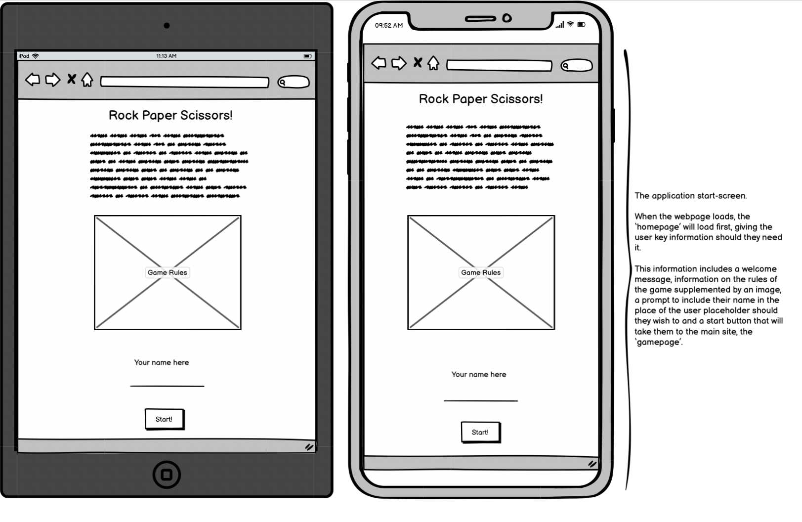
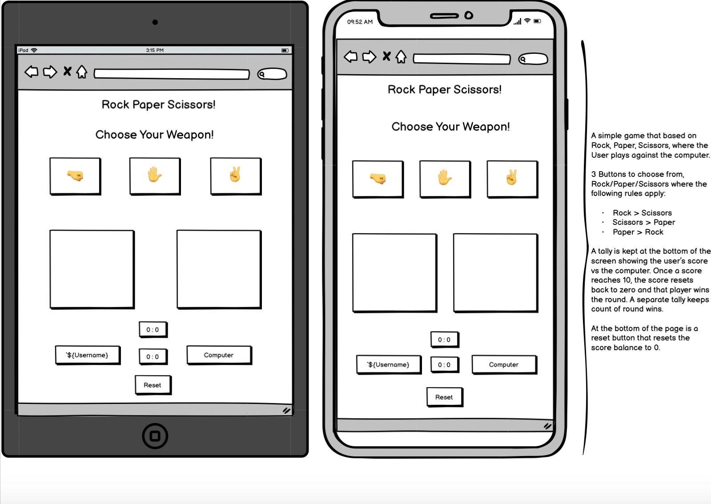

# Rock-Paper-Scissors

## Scope, Goals and Description
Welcome to my Rock-Paper-Scissors game! 

This is a player vs computer game where, following the rules of the game, the user and computer can score points up to 10, before one or the other wins that round. 

This game is designed to be played by someone who wants to play a game but doesn't have the time to play something complex. Perhaps on a mobile phone when travelling on the subway/underground. It is also ideal for a younger audience This game is at a simple enough complexity that is can be played and enjoyed by anyone, as it is everyday by children everywhere. The game has many variations to it across the globe, swapping out the names of rock, paper and scissors for other words, or adding complexity by introducing other variables (Such as Rock, Paper, Scissors, Lizard, Spock!). For my game, I've opted to keep the traditional 3 variable rock, paper and scissors!

The goal of this website, beyond testing my Javascript abilities, is to make a well-tested and fully functioning basic game that combines functionality with clean design and colours. 

[Live Link here](https://robrowno.github.io/rock-paper-scissors/)

---
## Website across different platforms

---
## Table of Contents
1. [Wireframe](#wireframe)
2. [UX Description](#ux-description)
3. [Technologies used](#technologies-used)
4. [Website Features](#website-features)
5. [Features to implement](#other-features-to-implement)
6. [Testing and Validation](#testing-and-validation)
7. [Bugs and Issues](#bugs-and-issues)
8. [Peer Reviews](#peer-reviews)
9. [Deployment](#deployment)
10. [Credits](#credits)
11. [Final Thoughts](#final-thoughts-for-pp2)

---
## Wireframe
I used Balsamiq to create my wireframes for this project. I took a mobile/tablet-first approach with this project, and as such, my wireframes reflect that. 

I first went about creating a wireframe for how I wanted my starting page to look, and when I was happy, I moved on to the game page sections for tablet and mobil respectively. 

### Starting Page

### Game Page

There is a key difference from the wireframe to the final product: I moved the scoring layout around from the original. 
I solely made this decision for an aesthetic reason. I felt it looked more pleasing to the eye. 

---
## UX Description

For this game, bright and bold colours were a must. However, I wanted to make sure that they kept the player's focus and didn't distract from the objective of the game!
I featured the following:

Colours:

- A radial gradient background featuring #fdbb2d, orange and aquamarine.
- Start-Game and Reset buttons in Green.
- All content boxes in Lightgreen.
- User and Computer score labels in Lightskyblue
- Score and Timer in #fff 
- All fonts and borders in Black. 

Layout:

- Start Page:
  - Game Rules 
  - Supporting Image 
  - Input field
  - Start Button

- Game Page:
  - Title/Return to Start Page
  - Player Choices bar
  - Username vs Computer bar
  - "Game Arena"
  - Win/Lose/Draw Banner following result
  - Another Username vs Comp bar displaying match score
  - Round score displayed beneath that
  - Reset game button

---

## Technologies used

- HTML5 - Used to structure my website
- CSS3 - Used to style my website
- JS - Used to provide logic to my website
- Github - The cloud based service for hosting repositories for over 73 million developers
- Git - Used to add, commit and push my changes to the server
- Balsamiq - Used to plan and create my wireframes for my projects
- Favicon.io - Used to source my favicon icons for my website
- Google Fonts - Used to source different fonts in my css file

---
## Website features

### Start-Page
An essential task for this website was to have to responsive displays that change upon clicking a button/div when the player is ready to play. 

By hiding the main page through surrounding it in a div in my html file, I was able to make this start page show by default and then hide that page when the player clicks 'start'. 

The Start-Page briefly describes the rules of the game of Rock, Paper, Scissors and tells the user how the scoring system works. An image provides visual feedback to the user as well to help cement the rules in their mind. When they feel they understand the rules of the game, then can enter a name/username and click 'start'. If they feel they need to go back to the start page to check over the rules or change their username, they can do so by clicking the title on the game page.

### Game-Page

Once the player has clicked start, the game page will appear. This is done by hiding the start page div in Javascript and revealing the main page div.
This is the full page on mobile: 

### Choices Bar

The game features a choices bar with 3 options to select. Rock (Fist emoji 🤜), Paper (Open hand emoji ✋) and Scissors (Peace sign emoji ✌️). There is an event listener on each choice that will listen for a click and replicate in the arena section. 
I designed this to be as simple and intuitive as possible, so that the player can clearly see where each choice is in seperate boxes and has a clear view of where each option is. 
Above the choices bar is the title, which when clicked on, takes the user back to the start page. There is a reminder of this on the start page as well. 

### Game Arena

The arena is where the users choice and the random computer generated response will show. The user choice will show on the left and the computer choice on the right. Hence, the player name always shows on the left. The layout is designed so that it's clear to the use that the left side is for them, and the right side is for the computer. 

### Before choice:

### After Choice:

### Banner displayed when player wins:

### Banner displayed when player loses:

### Banner displayed when player draws:

### Score Tally Section: 
This section displays the user and computer in a bar with the match score in between, and the round score below that. The match score will increment as the game goes on until one of the players reaches 10. At which point, the round tally will go up by one and reset the match scores back to 0 to play another round. 

At the very bottom of the page is a green reset div/button, that has an event listener that when clicked on, will reset all the scores (match and round) to 0 to start the game over again from thew beginning. 

For aesthetic and focal reasons, I put the match score between the player and user names ands the round score below. It takes inspiration from live tennis matches, by keeping the current score constantly at the 'front' or top and the rounds below. It assists in better keeping track of the score.

### Round-Over Modal:
This is the modal that displays when a round is won by either the player or the computer. Depending on which player wins the round, a different message will display. I've kept this message as simple as possible, so the player can quickly make a decision on whether they want to play another round or not. A hidden div makes it so the user cannot click on any of the game choices whilst the modal is up, to encourage a decision. 

### Round-Win modal:

### Round-Lose modal:

### Favicon:
This favicon of a fist emoji was chosen as it best suits the theme of the website and also allows users to easily identify the wesbsite if they have mulitple tabs open.

### Error 404 message:

I made a very basic custom error 404 page that will direct the user back to the main page. It isn't complicated and is kept very simple to simply guide the user back to the right page. 

---
## Other features to implement

Given more time to invest in the project, I would likely aim to implement the following features: 

- Either a countdown or count-up timer. Depending on which, there would either be a limited amount of time in which you have to win as many matches and rounds as you can, or in the case of counting up, the timer would serve just to show the user how long they've been playing.

- An extra pair of choices to replicate something akin to rock, paper, scissors, lizard, spock. This would add an extra layer of complexity to the game, and would be selectable as an option in-game, so the player could jump between 3 and 5 option versions of the game as they so desire.

- Some basic animation to the emojis to add some nice visual effects to the project. Perhaps an emoji can increase in size slightly for the winning player and decrease in size slightly for the losing player. 

---

## Testing and Validation

### Responsiveness Testing (Multi-Platform)

I began this project with a mobile first approach, with the goal of having a website that works fluently between a minimum width of 320px (such as a small mobile device) up to 3200px wide (such as a large laptop).

In order to do this, I tested my application on the following devices:
- Iphone 6s
- Iphone 12
- Macbook Pro
- Using the responsiveness checker in dev tools to visualise no other devices. 

Test:
- Using deployed link, open the Rock Paper Scissors game on Iphone and Mac to test functions, check for bugs and unexpected styling issues. 
- Using dev tools on my computer, I opened the website through the same link and right clicked my mouse to bring up an options list that brought up the dev tools option (inspect).
- If responsiveness on mobile and laptop is satisfactory, move to dev tools and select the preset widths above the website for mobile small, medium, large, tablet, laptop regular, large and large monitor. To further test, select the dimensions tab and select individual devices to visualise on acurate pixel sizes for various phones and tablets on the market right now. 

Expectation: Having used percentages and viewport width for a majority of the sizing on my project, and utilising flex and its associated properties, I worked hard to ensure that responsiveness targets were met early on. I expected the application to scale up and down in size as deemed necessary. Starting with a mobile first approach, I didn't expect any errors on small screens. 

Result: 

- Iphone 6s: 
  - Opened application link, and the start page loaded. Checked readability and layout. All good as expected. All features that needed to scale to size worked fine. All functions worked as expected. 

- Iphone 12:
  -  Opened application link, and the start page loaded. Checked readability and layout. All good as expected. All features that needed to scale to size worked fine. All functions worked as expected. 

- Macbook Pro:
  - Opened application link, and the start page loaded. Checked readability and layout. All good as expected. All features that needed to scale to size worked fine. All functions worked as expected. 

- DevTools Responsiveness: 
  - Opened application link, and the start page loaded. Right click and select inspect to access DevTools. Drag the slider to scale up and down the pixel width ranges. As long as you don't go much further below 320px and not much higher than 2000px wide, everything works and responds exactly as expected. 
- Further tests done in dev tools in the responsiveness tab to view website on other media such as mobiles and tablets. Iphone SE, Iphone XR, Samsung Galaxy S20 Ultra, Ipad mini/air, Samsung Galaxy S8+ among options that were tested. I am happy with the result on all of the above.

### Accessibility Testing

For testing accesibility and performance, I used Lighthouse in Dev tools. 
Lighthouse runs an audit of your website and feeds back a set of scores for accessibility, performance and best practices among others. 

I can confirm that the website passed with great scores. See report below:

### Feature/Functionality Testing

There are various events that occur on my project, so I had to compile a list of functionality testing to ensure I got exactly the right results each time.
This ranges from username inputs, to start/reset buttons and game buttons that trigger a visual and behind-the-scenes response. 

### Test 1: Username + Start button

Testing conducted for username and start button:

- Function: Display a username of the player's choosing before clicking the start button (Default to name 'User' if no input value is written in)
- Check Result: Usernames work upon input and clicking start. Desired outcome of 'User' displaying also true if no value is entered. 
- Issues: On smaller screen sizes, in order to keep consistency with layout design, if an entered username is quite long, it will make their 'user' bars extend to the right. 
This is a compromise I am ok with. 

### Test 2: Return to Start Page

Testing conducted for return to start page:

- Function: Click title "Rock Paper Scissors" to return to the start page
- Check Result: When on the game page, clicking on the title does take you back to the game page as expected. You can even change the user name whilst you are there if you choose to.
- Issues: None.

### Test 3: Testing Options bar and response

Testing options bar which acts as the main game function for the player:

- Function: Clicking on any one of the options in the bar will start the game by generating an automatic random computer response. Both choices will display in the arena below.
- Check Result: When clicking on any one of the rock, paper or scissors options, a random computer reaction occurs and both the player options show. When checking the console log for the random computer response, it proves that a random number associated with the options is picked each time. The results display correctly in their respective game arena boxes below. 
- Issues: None.

### Test 4: Banner displays

Testing for a win/lose/draw banner to tell the user the result of that round:

- Function: To appear under the game arena when the player and computer choices are displayed above.
- Check Result: On any selection and result, the correct banner displays on each result every time.
- Issues: None.

### Test 5: Score incrementation

Testing the incrementation function of the game. 

- Function: When eithe the player or the computer wins a round, a tally is kept below that goes up by 1 with each win, and doesn't increment at all if one or the other draws or loses a round. When 10 points are accumalarted, a round is won and tallied below that. 
- Check Result: When playing, the rounds increment correctly every time. When either the player or the user hits 10 points, a round is won and tallied correctly and the rounds reset back to 0 to begin a new round.
- Issues: None.

### Test 6: Modal Displays

Test the modal pop-up at the end of a round:

- Function: At the end of a round, depending on whether the User wins or loses, a modal displays with one of 2 messages.
- Check Result: On a round win or loss for the player, the correct respective message displays each time. A transparent div behind the message blocks the user from continuing to play until they click the 'x' on the modal.
- Issues: On smaller screen sizes, it is still sometimes possible to select the reset button despite the transparent div. However, with time constraints in mind and considering the nature of the button, I didn't deem this to be too important to address considering this was only prevalent on some small screen devices.

### Test 7: Reset button

Testing the reset button at the bottom of the game page:

- Function: To reset the game back to 0 on both the match and round points for both user and computer.
- Check Result: The reset button resets the score for both the match and round points as expected.
- Issues: No issues. 

### Test 8: Error 404 File

Testing the Error 404 for the website:

- Function: To display when an invalid entry on the website is requested. Display an option to return to the start page as well.
- Check Result: Error 404 page displays if you search for a page on the site that doesn't exist. The button that redirects you back to the start page works perfectly as well.
- Issues: None. 

### Validation:

HTML Validation through [HTML-Validator](https://validator.w3.org/)

No warnings or errors.

CSS Validation through [CSS-Validator](https://jigsaw.w3.org/css-validator/)

No warnings or errors.

JS Validation through [JS-Validator](https://jshint.com/)

No warnings or errors.

---
## Bugs and Issues
I had several issues with this project. And thanks to some keen-eyed people who helped me troubleshoot and gave me a walkthrough on debugging, I was able to get past them. 

- The first issue I had was that when I was trying to create a function for getting a result back from the computer, I was always getting a draw when I console.log'd the result. Turned out I wasn't specific enough in my targeting. I needed to use ".innerHTML" sooner than I thought in my code as before I found that out it was targetting a whole div. 

- I also had issues with getting the username to display correctly when entered in the input field. It was pointed out to me that I should use ".value" in my code and "||" to default back to the standard 'User' placeholder if nothing is written in the input field. 

- I put the debugger to good use when trying to see why my modals weren't being targetted as expected. Through getting to 10 points in-game and setting break points on the correct lines of code, I was able to work out why some elements weren't being targetted correctly and work on fixing it. I was suggested the idea of making the modal-outer transparent as a way to get around the issue of not being able to find a reliable way to 'stop' the game whilst the modal appears. 

- Early on, the win/lose/draw banner wasn't displaying as I had intended through my css styling. I found out it was because I needed to set the style.display to 'block' in my js file for it to be interpretted as I wanted it to. 

- When I moved my 404 files in to their own dedicated folder, my 404 file stopped loaded when I tested it and defaulted back to the standard github 404 error. 
I moved the 404 files back in to main section of the directory and this seemed to rectify the issue. 

- In my README file, the live link to my website didn't seem to be working at first, despite the url being correct. This was pointed out to me by user Rhiannon McNulty on Slack. I tried putting "https://" before the url link to see if that made a difference and it did!

---
## Peer reviews

For peer review, I firstly submitted my project to the peer-code-review channel on the C.I Slack community room. I had some good feedback about the running of the game, only some style change advice to take onboard and a keen user who save my live link wasn't working properly. 

I also sent a live link to a few good friends on Slack who kindly took the time to check out the game and give feedback. Same as above, everything worked great with them but they recommended some style changes. 

Finally, I submitted my project to a London-based code institute community whatsapp group for review and advice from them. They were impressed with the functionality of my website, and made suggestions on design and potential further implementations. 

---
## Deployment
Below are the steps to take to deploy this website:

Rock Paper Scissors! is deployed on Github (the cloud-based service that is hosting my repository). Follow the steps below to deploy a Github Repository through GitHub pages:

1. Select the repository that you want to deploy, and select the settings link at the top right of the menu bar (A 'cog' icon will show near it).
2. Select the pages section on the vertical navigation bar on the left.
3. On the Github pages tab, scroll to the Source area and change the "None" branch tab to "Main", followed by changing the folder selector to "Root".
4. Finally, save this setting and refresh the site until you are presented with the following message in green: "Your site is published at (Your Github web address)"

### Forking your Repository
You can fork your repository to create an exact copy of the original one. This allows you to make changes without altering the original repository. 
Take the steps below:

1. Find and select your chosen repository.
2. At the top right of the page, between the watch/unwatch tab and the star tab, select the "Fork" tab.
3. You should now see a copy of the same repository in your account.

### Cloning a Repository
How to make a local clone repository:

1. Find and select the chosen repository.
2. Click on the "Code" button above the displayed repository files.
3. Select and Copy the displayed link.
4. In Gitpod, change the directory to your desired location.
5. Type "git clone" in the terminal and paste the link, followed by pressing Enter on your keyboard. You have successfully created a clone for local use!

---
## Credits

- Fonts imported from: [Google Fonts](https://fonts.google.com/specimen/Varela+Round?preview.text=Rock%20Paper%20Scissors!&preview.text_type=custom)
- Favicons imported from: [Favicon.io](https://favicon.io/emoji-favicons/oncoming-fist)
- Learned how to make colour gradient backgrounds on: [cssgradient.io](https://cssgradient.io/)
- Image for Rock, Paper, Scissors rules came from here: [RPS Rules image](https://andygrunwald.com/blog/playing-rockpaperscissors-with-500-people/)
- Responsiveness check from: [Am I Responsive?](http://ami.responsivedesign.is/)
- W3 Schools inspired my modal design: [W3 Schools](https://www.w3schools.com/howto/howto_css_modals.asp)

### Help from Peers and mentors

- A massive thanks to Danilo D'Auria for his superb help in getting me through some hurdles on my JS journey!
- Many thanks to Daisy McGirr, my mentor through this project, who gave me all the guidance and support required to steer me in the right direction.
- The London C.I Coding Community group. Always supporting which me with my questions and giving great advice. 

---
## Final Thoughts for PP2 

This project really challenged my understanding of Javascript and I certainly learned a lot through doing this project and from getting help from peers and mentors across the board. The project has certainly inspired me to continue developing my JS skills further and I expect I will do some side-projects to accomplish this. 

---

[Go Back To The Top](#rock-paper-scissors)